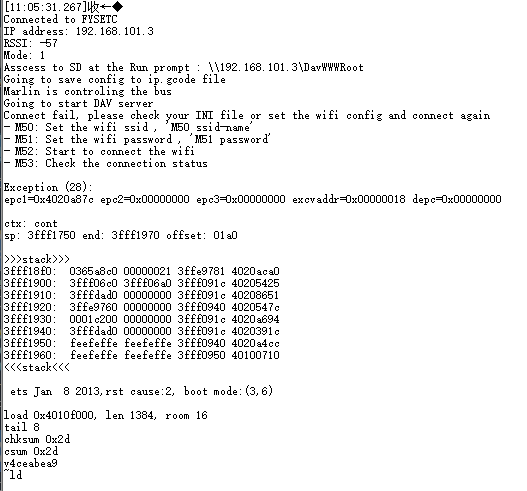

# FYSETC-SD-WIFI

This repository contains the infomation of FYSETC SD-WIFI module

## Firmware:

You can get the firmware [here](https://github.com/FYSETC/ESPWebDAV).

## Config

First you can see our video [FYSETC SD Wifi Wireless Transmission Module Introduction - YouTube](https://www.youtube.com/watch?v=2aW-65--NJk&t=24s). You have two ways to config the module.

*note: The card should be formatted for Fat16 or Fat32*

### Option 1: INI file

You can edit the example ```SETUP.INI``` file in ```ini``` folder, change the SSID and PASSWORD value. And then copy ```SETUP.INI``` file to your root SD card. Then insert it to the module. 

1. Turn the module option button to ```USB2UART``` 
2. Open a COM software in your computer
3. Connect the module to your computer with USB cable
4. Open the software COM port

you can see the module IP and other information.

*note: if you miss the serial output, you can click the ```RST``` button on the module. If you power it on with USB charger, you can check the module IP on your router*

### Option 2 : Command

Insert your sdcard to the module.

1. Turn the module option button to ```USB2UART``` 
2. Open a COM software in your computer
3. Connect the module to your computer with USB cable
4. Open the software COM port

And use the following command to connect the network or check the network status

    M50: Set the wifi ssid , 'M50 ssid-name'
    M51: Set the wifi password , 'M51 password'
    M52: Start to connect the wifi
    M53: Check the connection status

## Access

### windows

To access the drive from Windows, type ```\\ip\DavWWWRoot``` at the Run prompt, this will show in serial output as our video shows. [FYSETC SD Wifi Wireless Transmission Module Introduction - YouTube](https://www.youtube.com/watch?v=2aW-65--NJk&t=24s)

Or use Map Network Drive menu in Windows Explorer.

### MAC

Just need to use  ```http://192.168.0.x``` in access network drive option

## Issue shot

***The following problems occur in the SD-WIFI module, which may be due to insufficient power supply or signal problems.***



### Fix 1 :

The power supply of the USB interface connected to the SD-WIFI module is insufficient, if it is the host, change the USB interface to the rear; If it is a notebook computer, it is best to connect the power supply, directly connect to the USB port, do not connect to the extension dock.

### Fix 2 :

If the above method does not work, put the module as close to the wifi signal source as possible, or change to a strong wifi signal source, the signal is too weak will lead to connection errors.

### Fix 3 :

If Fix 2 cannot be implemented for some reason, the PHY mode of the module can be changed to enhance the module signal.

| WIFI_PHY_MODE     | Description                                                                                |
| ----------------- | ------------------------------------------------------------------------------------------ |
| WIFI_PHY_MODE_11B | The range is the largest, the speed is the slowest, and the power consumption is the most. |
| WIFI_PHY_MODE_11G | Medium range, speed and power consumption.                                                 |
| WIFI_PHY_MODE_11N | The range, power consumption is the smallest and the speed is the fastest.                 |

Modify firmware：

1. Open firmware with [arduino](https://www.arduino.cc/) software.
2. Global search“WiFi.setPhyMode”；
3. Navigate to“WiFi.setPhyMode(WIFI_PHY_MODE_11N); ”；
4. Replace the parentheses with "WIFI_PHY_MODE_11B" or "WIFI_PHY_MODE_11G"
5. Recompile and upload to the module。

## References

Firmware Compile and upload：https://github.com/FYSETC/ESPWebDAV